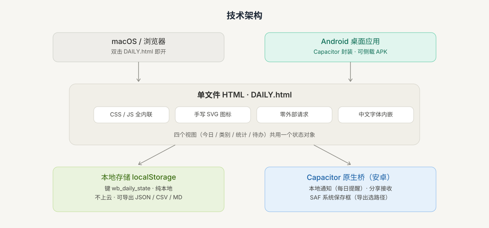

<p align="center">
  
</p>

<br/>

## <p align="center">DAILY · 日常打卡小工具</p>

> **一个单文件 HTML 的「每日任务打卡 + 异步待办」个人工作台。**
>
> 零外部依赖 · 数据存本地 · 双击即开 · 一键封装为安卓桌面应用。

<p align="center">
  <a href="DAILY.html"></a>
  <a href="Technical-Documentation.md"></a>
  <a href="Technical-Documentation.md"></a>
  <a href="android-app/README.md"></a>
  <a href="android-app/README.md"></a>
  <a href="#license"></a>
</p>

---

## 目录

- [为什么用 DAILY](#为什么用-daily)
- [核心功能](#核心功能)
- [快速开始](#快速开始)
- [技术架构](#技术架构)
- [项目结构](#项目结构)
- [数据模型](#数据模型)
- [数据与隐私](#数据与隐私)
- [文档与构建](#文档与构建)
- [License](#license)

---

## 为什么用 DAILY

整个应用就是**一个 `.html` 文件**——CSS、JS、图标、中文字体全部内联，双击即开、拷走即用。无需安装、无需服务器、无需联网。

<p align="center">
  
</p>

- **极简形态**：只有一个文件，随手拷贝即可在任意已安装浏览器的设备上使用。
- **本地优先**：所有数据存于浏览器 `localStorage`，不上云、无账号、无埋点；导出 JSON / CSV / Markdown 随时备份与迁移。
- **可自定义**：任务类别、达标门槛、计量单位、主题色全部自由配置；内置语义化推荐模板，新建时不用从零想。
- **可视化反馈**：进度环、日历热力图、趋势折线、迷你悬浮进度条，状态一眼可见；全达标还有彩屑与印章庆祝。
- **移动端可用**：手机浏览器打开即用；或经 Capacitor 封装为可侧载的安卓桌面应用（含本地通知与分享接收）。

---

## 核心功能

| 模块 | 说明 |
| --- | --- |
| **今日概览** | 顶部整体达标进度环 + 按时段极简问候；卡片只显示钉选的打卡项，一键 +1 |
| **任务类别** | 自定义图标 / 主题色 / 计量单位 / 每日目标 / 打卡步长；支持「详细计划」按步骤勾选、按星期每日分化 |
| **今日打卡** | 每类一张卡：进度环 + 图标 + 累计 / 目标；达标自动盖章；支持步长累加与带撤销的重置 |
| **统计** | 日历热力图（按达标比例上色）+ 年度热力图（365 格）+ 近 30 天 / 近 7 天达标率趋势折线 + 本周掠影 |
| **异步待办** | 不随日期刷新的长期小事：13 种语义化图标、星标置顶、拖拽重排、左滑完成 / 右滑删除、搜索与批量管理 |
| **深色模式** | 浅色 / 深色 / 跟随系统三档；深色采用暖炭护眼配色，全程无纯白 |
| **数据管理** | 导出 JSON 备份 / CSV 报表 / Markdown 周报；导入自动净化；手动保存面板兜底 |
| **解压音效** | Web Audio 实时合成、零素材：滴答 / 斩击 / 号角等，默认关闭 |
| **成就徽章** | 6 枚成就：首战告捷 / 一周不辍 / 月度坚持 / 百日长征 / 百次打卡 / 年度全勤 |
| **全达标庆祝** | 彩屑飘落 + 印章「今日圆满 ✦」+ 随机鼓励文案 + 号角音效，当日仅触发一次 |
| **迷你悬浮进度条** | 常驻右下角实时显示今日进度，点击跳回今日视图；长按卡片可快速 +1 |

---

## 快速开始

### 浏览器直接使用

```bash
# 无需任何依赖，双击即可
open DAILY.html
```

首次打开会自动填充示例任务，帮助你快速理解交互方式。

### 构建安卓 APK

前置环境：Node.js ≥ 22、Android Studio（SDK + Platform 34）、JDK 17、`ANDROID_HOME` 已配置（完整步骤见 [onboarding_guide.md](onboarding_guide.md)）。

```bash
cd android-app
bash build-android.sh     # 一键：同步网页 → cap sync → 构建 debug APK
adb install -r android/app/build/outputs/apk/debug/app-debug.apk   # 侧载到手机

bash build-android.sh release        # 正式签名版（需先配 keystore，见 onboarding_guide §3.3）
adb install -r android/app/build/outputs/apk/release/app-release.apk
```

### 数据备份与迁移

1. 顶栏「数据管理」→ 选择 **JSON 备份 / CSV 报表 / Markdown 周报** 导出。
2. 换设备时，在应用内导入 JSON 文件即可还原全部数据。

---

## 技术架构

<p align="center">
  
</p>

- **形态**：单文件 HTML，CSS / JS 全内联，图标全部手写内联 SVG，**零外部请求、零 emoji 图标**；中文字体（LXGW 文楷）以 base64 内嵌，离线可用。
- **状态存储**：`localStorage` 键 `wb_daily_state`，按日独立统计、不跨天滚动；主题偏好存于独立键 `wb_theme_pref`。
- **视图模型**：四个视图（今日 / 类别 / 统计 / 待办）共用一个状态对象，`showView()` 切换，互不牵连滚动。
- **安卓封装**：Capacitor 桥接 `@capacitor/local-notifications`（每日提醒）、`share`（分享接收）、`filesystem`（SAF 系统保存框）；浏览器端自动能力降级。

---

## 项目结构

```
DAILY-App/
├── DAILY.html                # 应用本体（单文件，含全部代码与字体）
├── README.md                 # 本文件
├── onboarding_guide.md       # 使用与构建总向导（新用户从这里开始）
├── assets/                   # README 配图（横幅 GIF / hero / 架构图）
├── Technical-Documentation.md# 功能模块、技术架构、数据模型全量文档
├── Android-Packaging.md      # 移动端封装方案对比与选型
├── docs/
│   └── specs/                # 功能设计文档
└── android-app/              # Capacitor 安卓壳工程
    ├── package.json          # Capacitor 依赖
    ├── capacitor.config.json # appId cn.orange.daily
    ├── sync-web.sh           # 同步网页 → web/index.html
    ├── build-android.sh      # 一键构建 APK
    └── android/              # 原生工程（含自定义图标 / SAF 插件）
```

---

## 数据模型

`wb_daily_state` 结构（**仅新增字段、绝不改名**，旧数据始终兼容）：

```json
{
  "tasks": [{ "id": "t1", "name": "阅读", "icon": "book", "color": "#3b82f6",
              "unit": "页", "target": 20, "step": 5 }],
  "records": { "2026-08-20": { "t1": 15 } },
  "sidequests": [{ "id": "s1", "text": "整理书桌", "icon": "pen",
                   "createdAt": 1755680000000, "star": true }],
  "settings": { "font": "wenkai", "ambient": true, "accent": "auto",
                "sound": false, "mini": false },
  "pinned": ["t1"],
  "planDone": { "2026-08-20": { "t1": [true, false] } },
  "seeded": true
}
```

---

## 数据与隐私

- 全部数据仅存于本机浏览器，**无网络请求、无后端、无埋点**。
- 导出文件仅在你确认后生成；导入走应用内确认弹窗与双层净化（`sanitizeState` + 渲染转义）。
- 「清空全部数据」需二次确认，防误删。

---

## 文档与构建

- [onboarding_guide.md](onboarding_guide.md) — 使用与构建总向导（新用户从这里开始）
- [Technical-Documentation.md](Technical-Documentation.md) — 功能模块、技术架构、数据模型
- [Android-Packaging.md](Android-Packaging.md) — 移动端封装方案对比与选型
- [android-app/README.md](android-app/README.md) — 安卓壳工程技术说明
- [android-app/build-android.sh](android-app/build-android.sh) — 一键构建 APK

---

## License

暂未正式选取，发布前建议选用 [MIT](https://opensource.org/licenses/MIT) 等宽松许可。

---

<p align="center">
  <sub>❝ 一个文件，装下你的每一个「今天」。❞</sub>
</p>